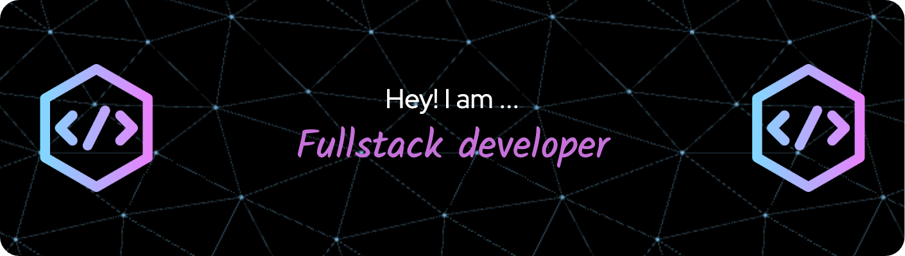

<h1 align="center">Hi 👋, I'm Aditya Kachade</h1>
<h3 align="center">Passionate about building seamless and efficient web applications, I'm exploring the realms of both frontend and backend development. Currently working with technologies like Node.js, React, Express, MongoDB, and SQL.</h3>

  

#  About Me:

- 💬 Ask me about java,html,css,bootstrap,sass,Javascript 

- 📫 How to reach me kachadeaditya@gmail.com

- 📄 Know about my experiences (https://drive.google.com/file/d/1A00WY0cmyn1fWhMwWF07ndFMDhtJxNfr/view?usp=drivesdk)

---

## 📌 Pinned Projects

---

## 🔥 Contribution Streak

---

<h3 align="left">Connect with me:</h3>

  
  
</a>

---

## Languages and Tools 

### Languages:
| Java | JS | 
|----------|----------|
|    |   | 

  
### Web Technologies:

| HTML | CSS | Bootstrap | Sass | Tailwind | Chakra UI | 
|----------|----------|----------|----------|----------|----------|
|  |  |  |  |  |  | 

### Web Frameworks and Databases:

| React JS | Node JS | Express JS | MongoDB | MySQL | REDUX |
|----------|----------|----------|----------|----------|----------|
|||||||

  

  

---

   
  

 

## 🏆 GitHub Trophies

